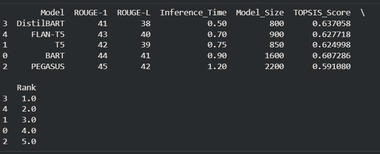
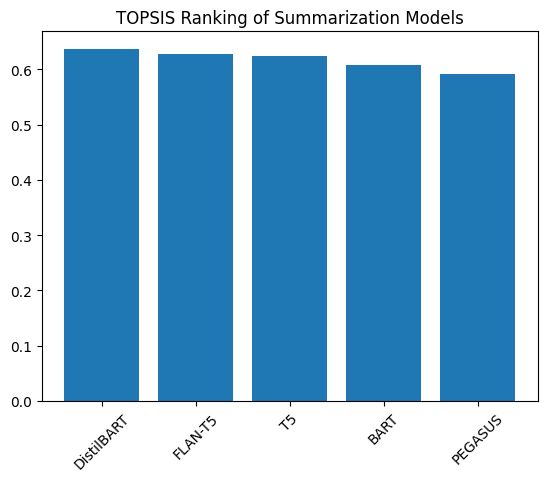

# Title: TOPSIS-Based Selection of Best Pre-trained Text Summarization Model
# 1. Methodology
Selecting pre-trained summarization models ----> Constructing decision matrix using performance and efficiency metrics ----> Normalizing the decision matrix ----> Applying weights to criteria ----> Determining ideal best and ideal worst solutions ----> Calculating Euclidean distances ----> Computing TOPSIS score ----> Ranking models ----> Graphical display of ranking results

# 2. Description

- Task: Text Summarization
- Models Compared: BART-large-CNN, T5-base, PEGASUS-XSum, DistilBART-CNN, FLAN-T5-base
- Evaluation Metrics: ROUGE-1, ROUGE-L, Inference Time, Model Size
- Benefit: ROUGE-1, ROUGE-L
- Cost: Inference Time, Model Size
- Weights: [0.35, 0.35, 0.15, 0.15]

# Method Used: 
TOPSIS (Technique for Order Preference by Similarity to Ideal Solution)

# Output: 
Ranked Table of Models with TOPSIS Score

# 3. Objectives
- To compare multiple pre-trained text summarization models
- To evaluate models based on both performance and efficiency
- To apply Multi-Criteria Decision Making (MCDM) using TOPSIS
- To determine the most balanced and optimal model
- To visualize ranking results using graphical representation

# 4. Results

